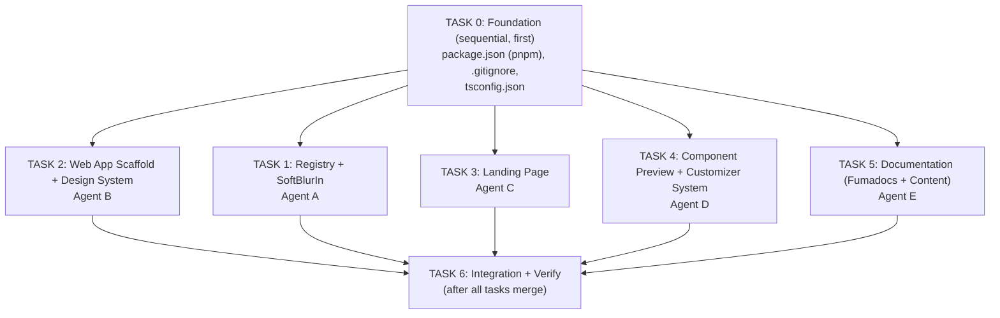

# Plan: snapcn — Initial Bootstrap (historical)

## Context

snapcn is a shadcn-style registry of production-ready Remotion video components. The repo started empty (only CLAUDE.md + DESIGN.md). This plan bootstrapped the whole project: a single flat Next.js app managed with pnpm, with Fumadocs docs, the shadcn registry, and the first primitive component (SoftBlurIn).

Design: Vercel visual language (DESIGN.md) — Geist fonts, shadow-as-border, aggressive negative letter-spacing, achromatic palette.

## File Structure

```
snap-cn/                            # flat Next.js app (no monorepo)
├── app/
│   ├── layout.tsx
│   ├── page.tsx                    # Landing (5 sections)
│   ├── docs/[[...slug]]/
│   │   ├── page.tsx
│   │   └── layout.tsx
│   └── r/[name]/
│       └── route.ts                # Registry API
├── components/
│   ├── hero-player.tsx
│   ├── copy-button.tsx
│   ├── component-preview.tsx       # Player + Customizer wrapper
│   ├── component-customizer.tsx
│   ├── props-table.tsx
│   ├── install-block.tsx
│   └── feature-card.tsx
├── content/docs/
│   ├── getting-started/ (introduction, installation, cli)
│   ├── primitives/ (soft-blur-in.mdx)
│   ├── compositions/ (placeholder)
│   └── guides/ (working-with-fonts, exporting-video)
├── lib/
│   ├── registry.ts
│   └── customizer-config.ts
├── registry/snap-cn/soft-blur-in.tsx
├── registry.json
├── source.ts
├── next.config.mjs
├── tailwind.config.ts
├── package.json
├── tsconfig.json
└── .gitignore
```

---

## Parallel Task Breakdown

The work is split into 5 independent tasks that can run simultaneously after a shared foundation step.



---

### TASK 0: Foundation (must run first, sequential)

**Files to create:**
- `package.json` — single flat package, pnpm as the package manager. Deps: next ^16, react ^19, fumadocs-* (core ^16, ui ^16, mdx ^14), @remotion/player ^4, remotion ^4, geist ^1, tailwindcss ^4, @tailwindcss/postcss ^4. Script: `"postinstall": "fumadocs-mdx"`
- `tsconfig.json` — base TS config, paths: `@/*`
- `.gitignore` — node_modules, .next, dist, out, .source/, next-env.d.ts

**Then run:** `pnpm install`

**CRITICAL NOTES from implementation:**
- **Next.js 16 is required** (not 15). fumadocs-ui v16.7 uses `useEffectEvent` from React, which is only included in Next.js 16's compiled React bundle. Next.js 15.x will fail with `'useEffectEvent' is not exported from 'react'`.
- Registry components live inside the app at `registry/snap-cn/` and are imported through the `@/*` tsconfig alias — no workspace linking or webpack alias is needed.

---

### TASK 1: Registry + SoftBlurIn Component (Agent A)

**Scope:** `registry/` only

**Files:**
- `registry.json` — shadcn v2 manifest with soft-blur-in item
- `registry/snap-cn/soft-blur-in.tsx` — the component

**SoftBlurIn spec:**
```tsx
// Uses useCurrentFrame(), useVideoConfig(), interpolate() from "remotion"
// Props: text: string, className?: string, blur?: number (default 10),
//        fontSize?: number (default 48), color?: string (default "#171717"), fontWeight?: number (default 600)
// Animates opacity 0→1 and filter: blur(Xpx)→blur(0px) over durationInFrames
// extrapolateRight: "clamp" on both interpolations
```

---

### TASK 2: Web App Scaffold + Design System (Agent B)

**Scope:** Core app config files, layout, design tokens

**Files:**
- `postcss.config.mjs` — `@tailwindcss/postcss` plugin
- `next.config.mjs` — `createMDX()` from fumadocs-mdx/next (registry components live in-repo under `registry/`, so no transpilePackages or alias config is needed)
- `app/globals.css` — Tailwind v4 `@import "tailwindcss"`, fumadocs CSS imports, `:root` CSS vars, `@theme` block with design tokens from DESIGN.md
- `app/layout.tsx` — Geist Sans + Mono, `RootProvider` from `fumadocs-ui/provider/next`, meta tags
- `source.config.ts` — `defineDocs({ dir: "content/docs" })`
- `source.ts` — `loader({ source: docs.toFumadocsSource(), baseUrl: "/docs" })`

**Design tokens** (from DESIGN.md):

| Token | Value |
|-------|-------|
| Background | `#ffffff` |
| Foreground | `#171717` |
| Muted | `#4d4d4d` |
| Border shadow | `0px 0px 0px 1px rgba(0,0,0,0.08)` |
| Card shadow | `rgba(0,0,0,0.08) 0px 0px 0px 1px, rgba(0,0,0,0.04) 0px 2px 2px, rgba(0,0,0,0.04) 0px 8px 8px -8px, #fafafa 0px 0px 0px 1px inset` |
| Link | `#0072f5` |
| Letter-spacing | -2.4px @48px, -1.28px @32px, -0.96px @24px, -0.32px @16px, normal @14px |
| Radius | 6px btns, 8px cards, 12px images, 9999px badges |

**CRITICAL NOTES:**
- `RootProvider` import is `fumadocs-ui/provider/next` (NOT `fumadocs-ui/provider`)
- `source.ts` must call `docs.toFumadocsSource()` — raw `docs` object doesn't satisfy `loader()` type
- Docs page must access MDX body via `const data = page.data as any; const MDX = data.body;` (generated types don't expose `body`)

---

### TASK 3: Landing Page (Agent C)

**Scope:** `app/page.tsx` + landing-specific components

**Files:**
- `app/page.tsx` — 5 sections: Hero, How It Works, Features, Gallery, Bottom CTA
- `components/hero-player.tsx` — "use client", @remotion/player with SoftBlurIn
- `components/copy-button.tsx` — "use client", clipboard copy with feedback
- `components/feature-card.tsx` — shadow-card styled card

**Design rules:**
- H1: 48px Geist, weight 600, letter-spacing -2.4px, color #171717
- Dark CTA: bg #171717, text white, 6px radius, 8px 16px padding
- Ghost CTA: white bg, shadow-border, 6px radius
- Cards: shadow-as-border, 8px radius
- Section spacing: py-24 to py-32

---

### TASK 4: Component Preview + Customizer System (Agent D)

**Scope:** Reusable preview/customizer infrastructure for all component doc pages

**Files:**
- `components/component-preview.tsx` — Player (left) + Customizer (right), tabs Preview/Code
- `components/component-customizer.tsx` — Controls: text, number (range), color, select, boolean
- `components/props-table.tsx` — Props API table
- `components/install-block.tsx` — `npx shadcn add snap-cn/...` with copy
- `lib/customizer-config.ts` — typed config + SoftBlurIn entry

**Customizer config type:**
```ts
type ControlType =
  | { type: "text"; default: string; label: string }
  | { type: "number"; default: number; min: number; max: number; step: number; label: string }
  | { type: "color"; default: string; label: string }
  | { type: "select"; default: string; options: string[]; label: string }
  | { type: "boolean"; default: boolean; label: string };
```

**SoftBlurIn customizer:** text, blur (1-30), fontSize (12-120), color, fontWeight (400/500/600)

---

### TASK 5: Documentation — Fumadocs + Content (Agent E)

**Scope:** Fumadocs setup + MDX content pages

**Files:**
- `app/docs/layout.tsx` — DocsLayout with sidebar
- `app/docs/[[...slug]]/page.tsx` — catch-all docs route (use `page.data as any` for body/toc)
- `app/r/[name]/route.ts` — registry API route
- MDX content: getting-started (introduction, installation, cli), primitives (soft-blur-in), guides (working-with-fonts, exporting-video)
- meta.json files for sidebar ordering

---

### TASK 6: Integration + Verify (after all tasks complete)

1. `pnpm install`
2. Fix any import path mismatches
3. `pnpm run dev` — verify localhost:3000
4. `pnpm run build` — production build must pass
5. Verify: landing page, docs pages, registry API
